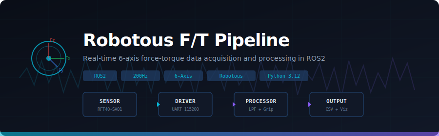
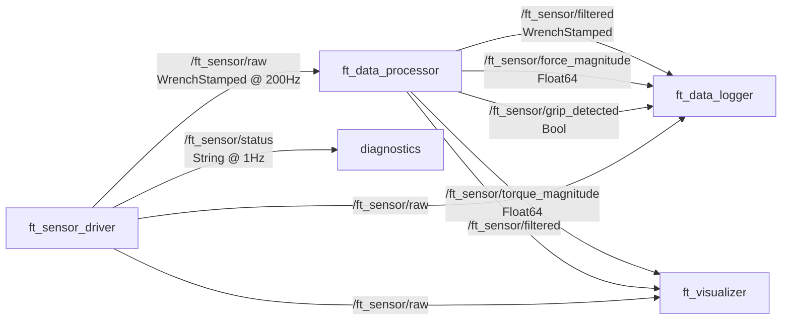

<div align="center">

# 🐕 RoboDog F/T Sensor Pipeline

### Real-Time 6-Axis Force-Torque Sensing for Assistive Robotic Dog Co-Walking

[](https://docs.ros.org/en/jazzy/)
[](https://ubuntu.com/)
[](https://python.org/)
[](https://www.robotous.com/)
[](LICENSE)
[]()

<br/>



<br/>

**A production-grade ROS2 pipeline for collecting, processing, and analyzing force-torque interaction data between older adults and an assistive robotic dog.**

[Getting Started](#-quick-start) · [Architecture](#-architecture) · [Hardware Setup](#-hardware) · [API Reference](#-api-reference) · [Contributing](#-contributing)

</div>

---

## 📋 About

As people age, walking difficulties reduce independence and increase fall risk. This project develops an **assistive robotic dog system** that walks alongside older adults, providing physical support through an instrumented handlebar. The robot dog's harness features a **6-axis force-torque sensor** that captures real-time interaction forces, enabling adaptive gait support.

This repository contains the **sensor data pipeline** — the foundational data layer that powers the entire system:

```
Human grips handlebar → F/T sensor measures forces → Pipeline processes data → Robot adapts
```

> **Part of the CITRIS-funded research**: *Assistive Robotic Dog Co-Walking to Improve Mobility in Older Adults*

---

## ✨ Features

| Feature | Description |
|---------|-------------|
| **200Hz Real-Time Streaming** | Full-rate data acquisition from the Robotous RFT40-SA01 sensor |
| **Binary Protocol Implementation** | Complete UART protocol handler matching the official Robotous manual v1.8 |
| **Butterworth Filtering** | Real-time 2nd-order low-pass filter with configurable cutoff frequency |
| **Force/Torque Decomposition** | 6-axis separation with magnitude computation and grip event detection |
| **Live Visualization** | 4-panel matplotlib dashboard: forces, torques, magnitudes, grip state |
| **Session Logging** | Timestamped CSV + rosbag2 with participant/trial metadata |
| **Bias Calibration** | Interactive calibration utility with automatic config file updates |
| **Mock Sensor** | Simulated gait-pattern generator for development without hardware |

---

## 🏗 Architecture

```
┌─────────────────────────────────────────────────────────────────────────┐
│                         ROS2 Jazzy Pipeline                            │
│                                                                        │
│  ┌───────────────────┐        ┌────────────────────┐                   │
│  │  ft_sensor_driver  │───────▶│  ft_data_processor  │                  │
│  │  ╌╌╌╌╌╌╌╌╌╌╌╌╌╌╌  │  raw   │  ╌╌╌╌╌╌╌╌╌╌╌╌╌╌╌╌  │                  │
│  │  Robotous UART     │        │  Butterworth LPF    │                  │
│  │  Protocol Handler  │        │  Magnitude Calc     │                  │
│  │  200Hz Streaming   │        │  Grip Detection     │                  │
│  └───────────────────┘        └─────────┬──────────┘                   │
│           ▲                             │                              │
│           │                   ┌─────────┼──────────────┐               │
│   ┌───────┴────────┐         ▼          ▼              ▼               │
│   │ ft_mock_sensor  │  ┌───────────┐ ┌───────────┐ ┌─────────┐        │
│   │ (dev/testing)   │  │ ft_logger │ │ visualizer│ │ rosbag2 │        │
│   └────────────────┘  │  CSV+Meta │ │ matplotlib│ │ recorder│        │
│                        └───────────┘ └───────────┘ └─────────┘        │
└─────────────────────────────────────────────────────────────────────────┘
```

### Topic Graph



---

## 🔧 Hardware

### Sensor: Robotous RFT40-SA01-D

| Specification | Value |
|---|---|
| **Type** | Capacitive 6-axis F/T |
| **Interface** | USB (FTDI FT230X Virtual COM) |
| **Force Range** | Fx,Fy: ±100N · Fz: ±150N |
| **Torque Range** | Tx,Ty,Tz: ±2.5Nm |
| **Resolution** | Force: 200mN · Torque: 8mNm |
| **Max Data Rate** | 200Hz @ 115200 baud |
| **Dimensions** | ø40mm × 18.5mm |
| **Weight** | 60g |
| **Protocol** | Binary UART (SOP/EOP framing) |

### Wiring (USB Interface)

```
Sensor Cable          Function
───────────           ────────
BLACK  ────────────── GND
RED    ────────────── VCC (5V)
GREEN  ────────────── D-
YELLOW ────────────── D+
```

> The USB interface uses an FTDI chip and appears as `/dev/ttyUSB0` on Linux. No external power supply needed — USB provides both power and data.

---

## 🚀 Quick Start

### Prerequisites

```bash
# ROS2 Jazzy (Ubuntu 24.04)
sudo apt install ros-jazzy-desktop

# Python dependencies
pip install pyserial numpy matplotlib pyyaml --break-system-packages

# Serial port permissions
sudo usermod -a -G dialout $USER && newgrp dialout
```

### Build

```bash
# Clone
git clone https://github.com/<your-username>/robodog-ft-pipeline.git
cd robodog-ft-pipeline

# Create workspace and symlink
mkdir -p ~/robodog_ws/src
ln -s $(pwd) ~/robodog_ws/src/ft_sensor_pipeline

# Build
cd ~/robodog_ws
source /opt/ros/jazzy/setup.bash
colcon build --packages-select ft_sensor_pipeline
source install/setup.bash
```

### Run

```bash
# 🧪 Test without hardware (mock sensor with simulated gait patterns)
ros2 launch ft_sensor_pipeline ft_pipeline_launch.py use_mock:=true

# 🔬 Run with real sensor
ros2 launch ft_sensor_pipeline ft_pipeline_launch.py

# 📊 Record a participant trial
ros2 launch ft_sensor_pipeline ft_pipeline_launch.py \
    participant_id:=P001 \
    trial_id:=T01 \
    condition:=with_robot \
    record_bag:=true
```

### Calibrate

```bash
# Zero the sensor (run with NO load applied)
python3 scripts/calibrate_bias.py \
    --port /dev/ttyUSB0 \
    --samples 500 \
    --config config/ft_sensor_params.yaml
```

---

## 📁 Project Structure

```
robodog-ft-pipeline/
├── .github/
│   ├── workflows/
│   │   └── ci.yml                  # Lint + build verification
│   └── ISSUE_TEMPLATE/
│       ├── bug_report.md
│       └── feature_request.md
├── config/
│   └── ft_sensor_params.yaml       # All tunable parameters
├── docs/
│   ├── img/
│   │   └── pipeline_banner.svg     # Repo banner graphic
│   ├── PROTOCOL.md                 # Robotous UART protocol reference
│   └── CALIBRATION.md              # Calibration procedures
├── launch/
│   └── ft_pipeline_launch.py       # Main launch file
├── scripts/
│   ├── ft_sensor_driver_node.py    # Sensor reader → /ft_sensor/raw
│   ├── ft_data_processor_node.py   # Filter + magnitude + grip
│   ├── ft_data_logger_node.py      # CSV + metadata logging
│   ├── ft_visualizer_node.py       # Real-time matplotlib dashboard
│   ├── ft_mock_sensor_node.py      # Gait-pattern simulator
│   └── calibrate_bias.py           # Bias calibration utility
├── src/
│   └── ft_sensor_pipeline/
│       ├── __init__.py
│       └── robotous_protocol.py    # UART protocol handler
├── test/
│   ├── test_protocol.py            # Protocol unit tests
│   └── test_pipeline.py            # Integration tests
├── CMakeLists.txt
├── package.xml
├── LICENSE
├── CHANGELOG.md
├── .gitignore
└── README.md                       # You are here
```

---

## 📡 API Reference

### Robotous Protocol (`src/ft_sensor_pipeline/robotous_protocol.py`)

The protocol handler implements the complete Robotous RFT Series UART communication spec.

```python
from ft_sensor_pipeline.robotous_protocol import RobotousProtocol

sensor = RobotousProtocol(
    port="/dev/ttyUSB0",
    baud_rate=115200,
    sensor_model="RFT40-SA01"  # Auto-sets DF=50, DT=2000
)

sensor.connect()

# Sensor info
sensor.read_model_name()        # → "RFT40-SA01-D"
sensor.read_serial_number()     # → "D00100166"
sensor.read_firmware_version()  # → "RFT40-01-2-05"

# Single reading
reading = sensor.read_ft_once()
print(f"Fx={reading.fx:.2f}N, Tz={reading.tz:.4f}Nm")

# Continuous streaming
sensor.start_streaming()
while True:
    reading = sensor.read_one()
    if reading:
        process(reading)

# Bias / tare
sensor.set_bias(enable=True)    # Zero the sensor
sensor.clear_bias()             # Remove bias

# Configuration (must stop streaming first)
sensor.set_output_rate(200)     # Hz: 10,20,50,100,200,333
sensor.set_filter(50)           # Cutoff Hz: 0(off),1..500

sensor.disconnect()
```

### ROS2 Topics

| Topic | Type | Rate | Description |
|---|---|---|---|
| `/ft_sensor/raw` | `geometry_msgs/WrenchStamped` | 200 Hz | Raw 6-axis F/T data |
| `/ft_sensor/filtered` | `geometry_msgs/WrenchStamped` | 200 Hz | Butterworth-filtered data |
| `/ft_sensor/force_magnitude` | `std_msgs/Float64` | 200 Hz | \|F\| = √(Fx²+Fy²+Fz²) |
| `/ft_sensor/torque_magnitude` | `std_msgs/Float64` | 200 Hz | \|T\| = √(Tx²+Ty²+Tz²) |
| `/ft_sensor/grip_detected` | `std_msgs/Bool` | 200 Hz | Force > threshold |
| `/ft_sensor/status` | `std_msgs/String` | 1 Hz | JSON diagnostics |

### Launch Arguments

| Argument | Default | Options |
|---|---|---|
| `use_mock` | `false` | `true` / `false` |
| `record_bag` | `false` | `true` / `false` |
| `visualize` | `true` | `true` / `false` |
| `participant_id` | `P000` | Any string |
| `trial_id` | `T00` | Any string |
| `condition` | `with_robot` | `with_robot` / `without_robot` |

---

## 🔬 Data Output

### CSV Format

Output: `~/robodog_data/csv/ft_session_{participant}_{trial}_{timestamp}.csv`

```csv
timestamp_sec,timestamp_nsec,raw_fx,raw_fy,raw_fz,raw_tx,raw_ty,raw_tz,filt_fx,filt_fy,filt_fz,filt_tx,filt_ty,filt_tz,force_magnitude,grip_detected,participant_id,trial_id,condition
1772502463,59000000,-0.02,-0.34,0.54,-0.0008,0.0003,0.0001,...
```

### Rosbag2

```bash
# Replay a recorded session
ros2 bag play ~/robodog_data/rosbags/session_20260302_174734/

# Inspect bag contents
ros2 bag info ~/robodog_data/rosbags/session_20260302_174734/
```

---

## ⚙️ Configuration

All parameters in [`config/ft_sensor_params.yaml`](config/ft_sensor_params.yaml):

```yaml
ft_sensor_driver:
  ros__parameters:
    serial_port: "/dev/ttyUSB0"
    baud_rate: 115200
    publish_rate_hz: 200.0
    sensor_model: "RFT40-SA01"

ft_data_processor:
  ros__parameters:
    filter_enabled: true
    filter_cutoff_hz: 10.0        # Gait frequency ~1-3Hz
    force_magnitude_threshold_n: 2.0

ft_data_logger:
  ros__parameters:
    csv_enabled: true
    csv_output_dir: "~/robodog_data/csv"
    participant_id: "P000"
```

---

## 🧪 Testing

```bash
# Run unit tests
python3 -m pytest test/ -v

# Verify sensor connection
python3 -c "
from src.ft_sensor_pipeline.robotous_protocol import RobotousProtocol
s = RobotousProtocol()
s.connect()
print(s.read_model_name())
s.disconnect()
"

# Monitor topic rates
ros2 topic hz /ft_sensor/raw
```

---

## 🗺 Roadmap

- [x] **Phase 1**: Sensor protocol & ROS2 pipeline
- [x] **Phase 2**: Real-time visualization & data logging
- [x] **Phase 3**: Bias calibration & mock sensor
- [ ] **Phase 4**: Isaac Sim — Unitree B1 walking autonomously
- [ ] **Phase 5**: Isaac Sim — Harness + F/T sensor + human co-walking
- [ ] **Phase 6**: Real Unitree B1 deployment
- [ ] **Phase 7**: ML gait quality estimation (Aim 3)
- [ ] **Phase 8**: Adaptive robot positioning control

---

## 📖 References

1. Structured exercise programs reduce mobility disability by 18% in older adults
2. Light stabilizing forces (~5N) improve gait stability
3. Robotous RFT Series Manual v1.8
4. ROS2 Jazzy Documentation

---

## 📄 License

This project is licensed under the MIT License — see [LICENSE](LICENSE) for details.

---

## 🤝 Contributing

Contributions are welcome! Please see [CONTRIBUTING.md](CONTRIBUTING.md) for guidelines.

---

<div align="center">

**Built with** 🔧 **at UC Merced** · CITRIS Research

*Empowering older adults through assistive robotics*

</div>
