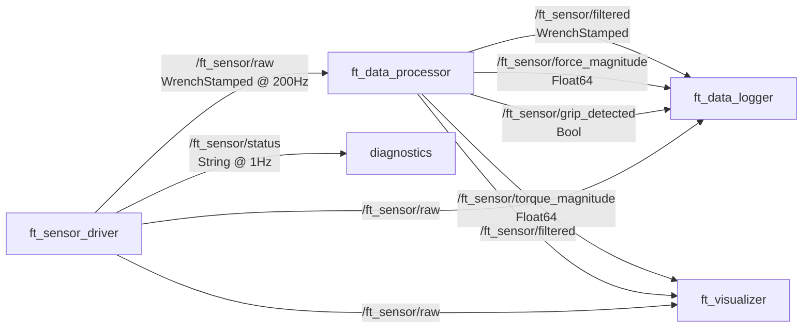

<div align="center">

# ⚡ Robotous F/T Sensor Pipeline

### Real-Time 6-Axis Force-Torque Data Acquisition & Processing in ROS2

[](https://docs.ros.org/en/jazzy/)
[](https://ubuntu.com/)
[](https://python.org/)
[](https://www.robotous.com/)
[](LICENSE)
[]()

<br/>


<br/>

**A production-grade ROS2 pipeline for real-time acquisition, filtering, visualization, and logging of 6-axis force-torque sensor data from Robotous RFT Series sensors.**

[Getting Started](#-quick-start) · [Architecture](#-architecture) · [Hardware Setup](#-hardware) · [API Reference](#-api-reference) · [Contributing](#-contributing)

</div>

---

## 📋 About

This repository provides a complete, ready-to-deploy ROS2 pipeline for the **Robotous RFT Series** 6-axis force-torque sensors. It handles everything from low-level binary UART communication to real-time visualization and session logging.

```
Sensor → UART Protocol → ROS2 Driver → Filter + Analysis → Visualization + Logging
```

The protocol implementation is built from scratch against the official **Robotous RFT-Series Manual v1.8**, using signed 16-bit integer decoding with model-specific dividers — not the simplified float approach found in most generic F/T drivers.

---

## ✨ Features

| Feature | Description |
|---------|-------------|
| **200Hz Real-Time Streaming** | Full-rate data acquisition from the Robotous RFT40-SA01 sensor |
| **Binary Protocol Implementation** | Complete UART protocol handler matching the official Robotous manual v1.8 |
| **Butterworth Filtering** | Real-time 2nd-order low-pass filter with configurable cutoff frequency |
| **Force/Torque Decomposition** | 6-axis separation with magnitude computation and threshold detection |
| **Live Visualization** | 4-panel matplotlib dashboard: forces, torques, magnitudes, threshold state |
| **Session Logging** | Timestamped CSV + rosbag2 with session metadata |
| **Bias Calibration** | Interactive calibration utility with automatic config file updates |
| **Mock Sensor** | Simulated force-pattern generator for development without hardware |

---

## 🏗 Architecture

```
┌─────────────────────────────────────────────────────────────────────────┐
│                         ROS2 Jazzy Pipeline                            │
│                                                                        │
│  ┌───────────────────┐        ┌────────────────────┐                   │
│  │  ft_sensor_driver  │───────▶│  ft_data_processor  │                  │
│  │  ╌╌╌╌╌╌╌╌╌╌╌╌╌╌╌  │  raw   │  ╌╌╌╌╌╌╌╌╌╌╌╌╌╌╌╌  │                  │
│  │  Robotous UART     │        │  Butterworth LPF    │                  │
│  │  Protocol Handler  │        │  Magnitude Calc     │                  │
│  │  200Hz Streaming   │        │  Threshold Detect   │                  │
│  └───────────────────┘        └─────────┬──────────┘                   │
│           ▲                             │                              │
│           │                   ┌─────────┼──────────────┐               │
│   ┌───────┴────────┐         ▼          ▼              ▼               │
│   │ ft_mock_sensor  │  ┌───────────┐ ┌───────────┐ ┌─────────┐        │
│   │ (dev/testing)   │  │ ft_logger │ │ visualizer│ │ rosbag2 │        │
│   └────────────────┘  │  CSV+Meta │ │ matplotlib│ │ recorder│        │
│                        └───────────┘ └───────────┘ └─────────┘        │
└─────────────────────────────────────────────────────────────────────────┘
```

### Topic Graph



---

## 🔧 Hardware

### Sensor: Robotous RFT40-SA01-D

| Specification | Value |
|---|---|
| **Type** | Capacitive 6-axis F/T |
| **Interface** | USB (FTDI FT230X Virtual COM) |
| **Force Range** | Fx,Fy: ±100N · Fz: ±150N |
| **Torque Range** | Tx,Ty,Tz: ±2.5Nm |
| **Resolution** | Force: 200mN · Torque: 8mNm |
| **Max Data Rate** | 200Hz @ 115200 baud |
| **Dimensions** | ø40mm × 18.5mm |
| **Weight** | 60g |
| **Protocol** | Binary UART (SOP/EOP framing) |

### Supported Models

The protocol handler supports all RFT Series models with automatic divider selection:

`RFT40-SA01` · `RFT44-SB01` · `RFT60-HA01` · `RFT64-SB01` · `RFT64-6A01` · `RFT80-6A01` · `RFT80-6A02`

### Wiring (USB Interface)

```
Sensor Cable          Function
───────────           ────────
BLACK  ────────────── GND
RED    ────────────── VCC (5V)
GREEN  ────────────── D-
YELLOW ────────────── D+
```

> The USB interface uses an FTDI chip and appears as `/dev/ttyUSB0` on Linux. No external power supply needed — USB provides both power and data.

---

## 🚀 Quick Start

### Prerequisites

```bash
# ROS2 Jazzy (Ubuntu 24.04)
sudo apt install ros-jazzy-desktop

# Python dependencies
pip install pyserial numpy matplotlib pyyaml --break-system-packages

# Serial port permissions
sudo usermod -a -G dialout $USER && newgrp dialout
```

### Build

```bash
# Clone
git clone https://github.com/ItsLP18/robotous-ft-pipeline.git
cd robotous-ft-pipeline

# Create workspace and symlink
mkdir -p ~/ft_sensor_ws/src
ln -s $(pwd) ~/ft_sensor_ws/src/ft_sensor_pipeline

# Build
cd ~/ft_sensor_ws
source /opt/ros/jazzy/setup.bash
colcon build --packages-select ft_sensor_pipeline
source install/setup.bash
```

### Run

```bash
# 🧪 Test without hardware (mock sensor with simulated force patterns)
ros2 launch ft_sensor_pipeline ft_pipeline_launch.py use_mock:=true

# 🔬 Run with real sensor
ros2 launch ft_sensor_pipeline ft_pipeline_launch.py

# 📊 Record a data session
ros2 launch ft_sensor_pipeline ft_pipeline_launch.py \
    participant_id:=S001 \
    trial_id:=T01 \
    record_bag:=true
```

### Calibrate

```bash
# Zero the sensor (run with NO load applied)
python3 scripts/calibrate_bias.py \
    --port /dev/ttyUSB0 \
    --samples 500 \
    --config config/ft_sensor_params.yaml
```

---

## 📁 Project Structure

```
robotous-ft-pipeline/
├── .github/
│   ├── workflows/
│   │   └── ci.yml                  # Lint + build verification
│   └── ISSUE_TEMPLATE/
│       ├── bug_report.md
│       └── feature_request.md
├── config/
│   └── ft_sensor_params.yaml       # All tunable parameters
├── docs/
│   ├── img/
│   │   └── pipeline_banner.svg     # Repo banner graphic
│   ├── PROTOCOL.md                 # Robotous UART protocol reference
│   └── CALIBRATION.md              # Calibration procedures
├── launch/
│   └── ft_pipeline_launch.py       # Main launch file
├── scripts/
│   ├── ft_sensor_driver_node.py    # Sensor reader → /ft_sensor/raw
│   ├── ft_data_processor_node.py   # Filter + magnitude + threshold
│   ├── ft_data_logger_node.py      # CSV + metadata logging
│   ├── ft_visualizer_node.py       # Real-time matplotlib dashboard
│   ├── ft_mock_sensor_node.py      # Force-pattern simulator
│   └── calibrate_bias.py           # Bias calibration utility
├── src/
│   └── ft_sensor_pipeline/
│       ├── __init__.py
│       └── robotous_protocol.py    # UART protocol handler
├── test/
│   └── test_protocol.py            # Protocol unit tests (33 tests)
├── CMakeLists.txt
├── package.xml
├── LICENSE
├── CHANGELOG.md
├── .gitignore
└── README.md
```

---

## 📡 API Reference

### Robotous Protocol (`src/ft_sensor_pipeline/robotous_protocol.py`)

The protocol handler implements the complete Robotous RFT Series UART communication spec.

```python
from ft_sensor_pipeline.robotous_protocol import RobotousProtocol

sensor = RobotousProtocol(
    port="/dev/ttyUSB0",
    baud_rate=115200,
    sensor_model="RFT40-SA01"  # Auto-sets DF=50, DT=2000
)

sensor.connect()

# Sensor info
sensor.read_model_name()        # → "RFT40-SA01-D"
sensor.read_serial_number()     # → "D00100166"
sensor.read_firmware_version()  # → "RFT40-01-2-05"

# Single reading
reading = sensor.read_ft_once()
print(f"Fx={reading.fx:.2f}N, Tz={reading.tz:.4f}Nm")

# Continuous streaming
sensor.start_streaming()
while True:
    reading = sensor.read_one()
    if reading:
        process(reading)

# Bias / tare
sensor.set_bias(enable=True)    # Zero the sensor
sensor.clear_bias()             # Remove bias

# Configuration
sensor.set_output_rate(200)     # Hz: 10,20,50,100,200,333
sensor.set_filter(50)           # Cutoff Hz: 0(off),1..500

sensor.disconnect()
```

### ROS2 Topics

| Topic | Type | Rate | Description |
|---|---|---|---|
| `/ft_sensor/raw` | `geometry_msgs/WrenchStamped` | 200 Hz | Raw 6-axis F/T data |
| `/ft_sensor/filtered` | `geometry_msgs/WrenchStamped` | 200 Hz | Butterworth-filtered data |
| `/ft_sensor/force_magnitude` | `std_msgs/Float64` | 200 Hz | \|F\| = √(Fx²+Fy²+Fz²) |
| `/ft_sensor/torque_magnitude` | `std_msgs/Float64` | 200 Hz | \|T\| = √(Tx²+Ty²+Tz²) |
| `/ft_sensor/grip_detected` | `std_msgs/Bool` | 200 Hz | Force exceeds threshold |
| `/ft_sensor/status` | `std_msgs/String` | 1 Hz | JSON diagnostics |

### Launch Arguments

| Argument | Default | Options |
|---|---|---|
| `use_mock` | `false` | `true` / `false` |
| `record_bag` | `false` | `true` / `false` |
| `visualize` | `true` | `true` / `false` |
| `participant_id` | `P000` | Any string |
| `trial_id` | `T00` | Any string |
| `condition` | `default` | Any string |

---

## 🔬 Data Output

### CSV Format

Output: `~/ft_sensor_data/csv/ft_session_{id}_{trial}_{timestamp}.csv`

```csv
timestamp_sec,timestamp_nsec,raw_fx,raw_fy,raw_fz,raw_tx,raw_ty,raw_tz,filt_fx,filt_fy,filt_fz,filt_tx,filt_ty,filt_tz,force_magnitude,grip_detected,participant_id,trial_id,condition
1772502463,59000000,-0.02,-0.34,0.54,-0.0008,0.0003,0.0001,...
```

### Rosbag2

```bash
# Replay a recorded session
ros2 bag play ~/ft_sensor_data/rosbags/session_20260302_174734/

# Inspect bag contents
ros2 bag info ~/ft_sensor_data/rosbags/session_20260302_174734/
```

---

## ⚙️ Configuration

All parameters in [`config/ft_sensor_params.yaml`](config/ft_sensor_params.yaml):

```yaml
ft_sensor_driver:
  ros__parameters:
    serial_port: "/dev/ttyUSB0"
    baud_rate: 115200
    publish_rate_hz: 200.0
    sensor_model: "RFT40-SA01"

ft_data_processor:
  ros__parameters:
    filter_enabled: true
    filter_cutoff_hz: 10.0
    force_magnitude_threshold_n: 2.0

ft_data_logger:
  ros__parameters:
    csv_enabled: true
    csv_output_dir: "~/ft_sensor_data/csv"
```

---

## 🧪 Testing

```bash
# Run unit tests (33 tests across 5 test classes)
python3 -m pytest test/ -v

# Verify sensor connection
python3 -c "
from src.ft_sensor_pipeline.robotous_protocol import RobotousProtocol
s = RobotousProtocol()
s.connect()
print(s.read_model_name())
s.disconnect()
"

# Monitor topic rates
ros2 topic hz /ft_sensor/raw
```

---

## 🗺 Roadmap

- [x] Complete UART protocol handler (verified against manual v1.8 + real hardware)
- [x] Real-time 200Hz streaming with Butterworth filtering
- [x] Live 4-panel visualization dashboard
- [x] CSV + rosbag2 session logging with metadata
- [x] Bias calibration utility
- [x] Mock sensor for hardware-free development
- [x] 33 unit tests + CI/CD with GitHub Actions
- [ ] Multi-sensor support (daisy-chain / multiple USB)
- [ ] ROS2 lifecycle node integration
- [ ] Web-based visualization (Foxglove bridge)

---

## 📖 Protocol Documentation

Full Robotous UART protocol reference is available in [`docs/PROTOCOL.md`](docs/PROTOCOL.md), covering:

- Frame structure (SOP/EOP, checksums)
- Complete command set (18 commands)
- Data conversion formulas & model-specific dividers
- Baud rate, output rate, and filter configuration tables
- Overload status byte decoding

---

## 📄 License

This project is licensed under the MIT License — see [LICENSE](LICENSE) for details.

---

## 🤝 Contributing

Contributions are welcome! Please see [CONTRIBUTING.md](CONTRIBUTING.md) for guidelines.

---

<div align="center">

**Built with** 🔧 **ROS2 Jazzy · Python 3.12 · Robotous RFT Series**

</div>
